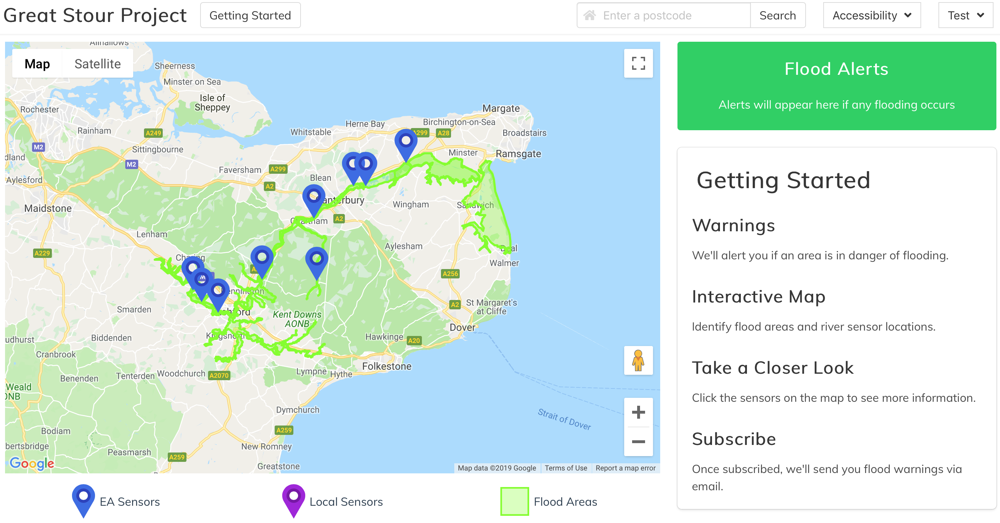
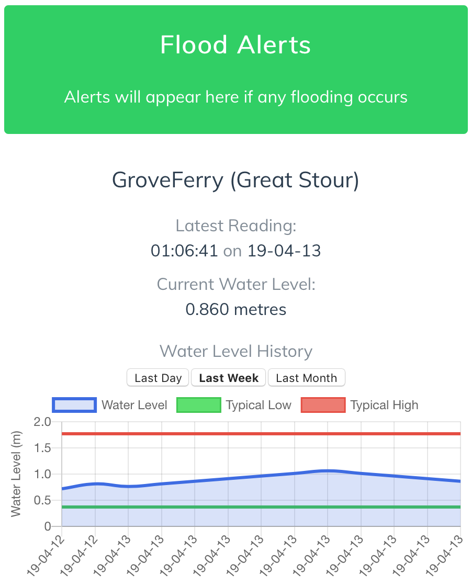
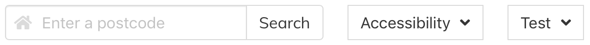
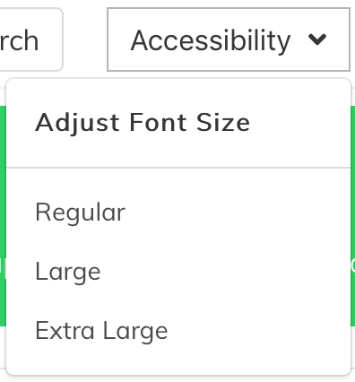
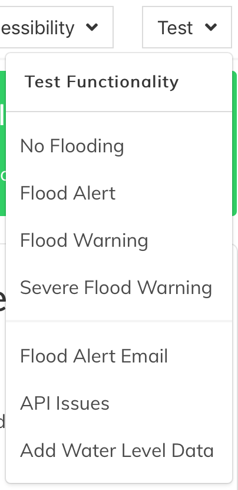

# Yangtze Project
Develop a web-driven interface that reports the condition of the Great Stour to domestic users.

## Vue.js Frontend

### Overview



### Information Display

The info window displays information on the selected part of the river including live readings and historical water levels.
The flood alert will display severity levels based on historical comparisons.



### Tob Bar

The top bar affords the ability to search for the nearest flood area for a given post code.
It also offers dropdowns for accessibility and test options.



### Accessibility

Allows for font size selected for visually impaired users.



### Test Mode

A series of options to test functionality across the app that may not be accessible in normal scenarios.
This includes displaying alternative types of flood alerts for a given water level, sending flood alert emails,
seeing how api issues are handled as well as adding fake river level data to see how the graph changes. 



## Node.js Backend

The REST API provides:

- Sensor readings
- Flood warnings
- Flood areas
- Subscribing to alerts

The backend also performs initialisation and background processes including:

- Initialising the database
- Populating initial data
- Syncing remote data from sensors via REST endpoints
- Intermittent polling of remote data via REST and MQTT
- Triggering flood alerts to subscribed users

## Deployment

```bash
docker-compose up -d
```

### Environment Requirements:

The following are environment variables required to run the application. These can be set in a `.env` file for convenience.

- NODE_ENV
- EMAIL
- EMAIL_PASSWORD
- TTN_ID
- TTN_KEY
- DB_HOST
- DB_PORT
- DB_NAME
- DB_USER
- DB_PASSWORD
- DB_DIALECT
- VUE_APP_API_BASE
- VUE_APP_GMAP_KEY
- MYSQL_ROOT_PASSWORD

### How Deployment Works

**Frontend**: Production build in Node image which is subsequently hosted in an nginx container.

**Backend**: Node container with added git capabilities due to the npm TTN package dependency.

**Database**: MySQL container with initdb setting.

## Contributors

- [okinskas](https://github.com/okinskas)
- [jonathanfrosty](https://github.com/jonathanfrosty)
- [ShaqNew](https://github.com/ShaqNew)
- [FermitTheKrog](https://github.com/FermitTheKrog)
